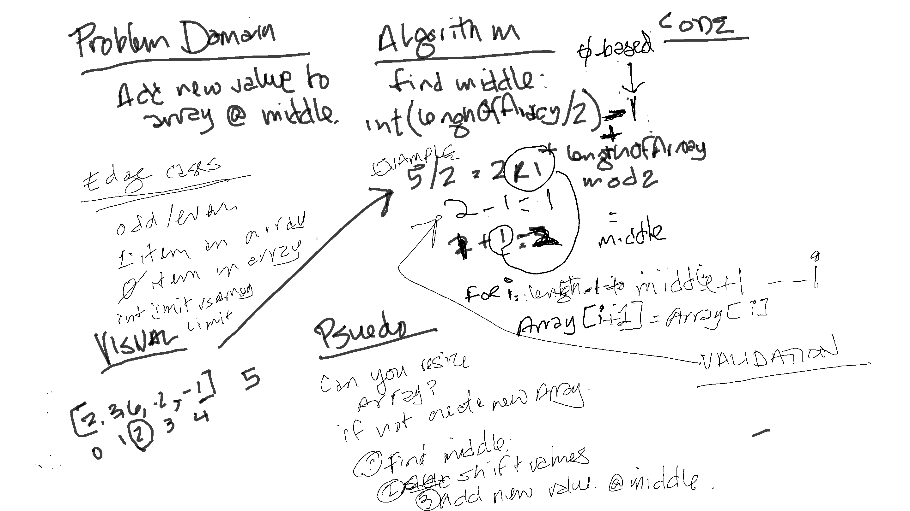

#Insert to Middle of Array

Feature Tasks
Write a function called insertShiftArray which takes in an array and a value to be added. Without utilizing any of the built-in methods available to your language, return an array with the new value added at the middle index.

#The Approach

First I figured out the algorithm to find the middle, then the iteration loop to move (shift) the values.

The time this approach will take is based on the the iterations: length of array /2.
